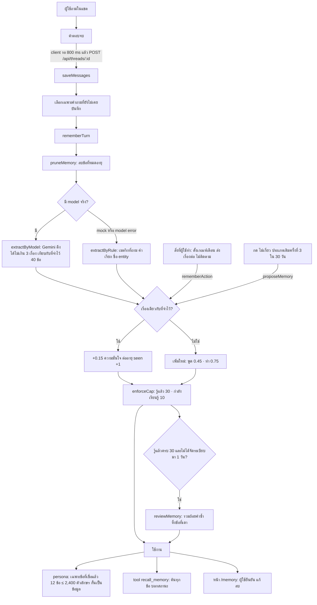

# ความจำของ Winyu (memory)

Winyu จำเรื่องเล็ก ๆ เกี่ยวกับผู้ใช้แต่ละคน: สนใจเรื่องอะไร เรียกสิ่งต่าง ๆ ว่าอะไร ชอบดูข้อมูลแบบไหน ดูแลอะไร เพื่อให้ครั้งหน้าตอบตรงขึ้นโดยไม่ต้องอธิบายซ้ำ ความจำเป็นของผู้ใช้คนนั้นคนเดียว ไม่เก็บตัวเลขหรือผลลัพธ์ และไม่ถูกใช้จนกว่าจะเชื่อได้

โค้ดหลัก: `lib/engine/memory.ts` (เรียนรู้ เลื่อนสถานะ ลืม) · `lib/engine/memory-status.ts` (สถานะ) · `lib/engine/memory-match.ts` (เรื่องเดียวกันไหม) · `lib/engine/memory-review.ts` (ให้โมเดลจัดระเบียบ) · prompt ภาษาไทยใน `lib/i18n/th.ts` (`TH.memory`)

## Flow

## สถานะ

| สถานะ | เกิดจาก | ความมั่นใจ | อายุ | เข้า prompt |
|---|---|---|---|---|
| กำลังเรียนรู้ | ได้ยินครั้งแรกจากแชต หรือ Winyu เสนอเอง (`proposeMemory`) | 0.45 | 14 วัน | ไม่ |
| รู้แล้ว | ได้ยินซ้ำ (0.45 + 0.15 = 0.6) หรือมาจากสิ่งที่ผู้ใช้ทำ (0.75) | ≥ 0.6 | 90 วัน นับจากครั้งล่าสุดที่เห็น | ใช่ |
| ยืนยันแล้ว | ผู้ใช้กด "ใช่ จำไว้" หรือแก้ถ้อยคำเองใน `/memory` | 0.98 | ไม่หมดอายุ | ใช่ เสมอ |

ทุกครั้งที่เห็นซ้ำความมั่นใจเพิ่ม 0.15 (สูงสุด 0.98) และอายุนับใหม่ตามสถานะใหม่ ข้อที่ได้ยินครั้งเดียวจึงไม่มีผลกับคำตอบเลย นี่คือด่านกันความจำผิด: ตัวดึงความจำพลาดได้ แต่ข้อที่พลาดจะหายไปเองใน 14 วันถ้าไม่มีอะไรยืนยัน

## ความจำมาจากไหน

| ที่มา | ฟังก์ชัน | เรียกจาก | ตัวอย่างข้อความ | เริ่มที่ |
|---|---|---|---|---|
| สิ่งที่พูดในแชต | `rememberTurn` | `lib/server/threads.ts` `saveMessages` | สนใจความคลาดเคลื่อนพยากรณ์ (MAPE) | 0.45 |
| ตั้งเกณฑ์เตือน | `rememberAction` | `lib/server/watches.ts` | ให้เตือนเมื่อ<เมตริก> <เงื่อนไข> | 0.75 |
| ส่งเรื่องต่อ | `rememberAction` | `lib/server/handoff.ts` | เรื่อง<เมตริก ขอบเขต> ส่งให้<ชื่อ> | 0.75 |
| ไม่ติดตาม alert | `rememberAction` | `lib/server/alerts.ts` | ไม่ติดตาม<เมตริก ขอบเขต> | 0.75 |
| กด "ไม่เกี่ยว" 3 ครั้ง | `proposeMemory` | `lib/server/feed.ts` | ไม่ติดตาม<ประเภท> | 0.45 |

ข้อที่ไม่ได้มาจากแชต (`sourceThreadId = null`) แสดงในหน้า `/memory` ว่า "จากสิ่งที่คุณทำ" และ `reviewMemory` ไม่ทิ้งหรือเขียนใหม่

ประเภท (`MemoryFact.type`): `interest` สนใจเรื่องอะไร · `vocabulary` เรียกสิ่งใดว่าอะไร · `preference` ชอบดูแบบไหน เกณฑ์ที่ตั้ง สิ่งที่ไม่ติดตาม · `responsibility` สิ่งที่ผู้ใช้บอกเองว่าดูแล หรือส่งเรื่องให้ใคร · `seasonal` เรื่องที่ผูกกับช่วงเวลาของปี

## ตัวดึงความจำ

`extractByModel` ส่ง Gemini (model ตัวแรกใน registry ผ่าน `utilityModel()`) ด้วย `generateObject` และ schema ที่คืนได้ไม่เกิน 3 เรื่องต่อครั้ง สิ่งที่ส่งไป: prompt ระบบ `TH.memory.systemPrompt`, ความจำเดิม 40 ข้อแรกพร้อมรหัสสั้น (`k1`, `k2` …) และคำถามใหม่ ทั้งสองส่วนกั้นด้วย `fenceAsData` model ตอบ `sameAs` เป็นรหัสเดิมเมื่อเป็นเรื่องที่จำไว้แล้ว

ถ้าไม่มี model จริง (mock) หรือ model error จะใช้ `extractByRule` แทน: เมตริกที่ชื่อหรือคำพ้องอยู่ในคำถาม (`สนใจ<เมตริก>เป็นประจำ`), คำพ้องที่ชี้เมตริกเดียว (`เรียก<เมตริก>ว่า "<คำ>"`) และ entity ที่ระบุชื่อ (`ติดตาม <ชื่อ> อยู่เสมอ`)

เรื่องเดียวกันไหม (`isSameFact`): type ต้องตรง แล้วถ้อยคำเหมือนกันเป๊ะ หรือ ตัดคำเติม (สนใจ ดูแล เป็นประจำ …) แล้ว trigram Dice ≥ 0.4 และไม่มีเมตริกหรือคำในเครื่องหมายคำพูดที่ฝั่งหนึ่งมีแต่อีกฝั่งไม่มีทั้งสองทาง

## ความจำถูกลบตอนไหน

| ตอน | ลบอะไร | ที่ |
|---|---|---|
| ทุกครั้งที่เรียนรู้หรือมีคนเปิดดู | ข้อที่เลย `decayAt` แล้ว | `pruneMemory` ใน `rememberTurn`, `rememberAction`, `proposeMemory`, `GET /api/memory` (หน้าแรกเรียกทุกครั้งที่โหลด รวมถึงตอนสลับ persona), หน้า `/memory`, `consolidateMemory` |
| หลังเพิ่มทุกครั้ง | ส่วนที่เกินเพดาน: รู้แล้วเกิน 30 (เก็บตามสถานะ ความมั่นใจ ล่าสุด) · กำลังเรียนรู้เกิน 10 (เก็บข้อที่เห็นล่าสุด) | `enforceCap` |
| รู้แล้วครบ 30 ข้อ วันละครั้ง | ข้อที่ model บอกว่าเดาหน้าที่จากคำถาม เป็นเรื่องของตัวระบบ หรือแคบจนใช้ได้คำถามเดียว (ไม่แตะข้อที่ยืนยันหรือมาจากการกระทำ) | `reviewMemory` |
| ผู้ใช้สั่ง | ทีละข้อ หรือทั้งหมด | `DELETE /api/memory/:id`, `DELETE /api/memory` |
| dev | ทั้งหมดของทุกคน | `bun run seed` (ลบ `.data`) |

`bun run memory:tidy` รวมข้อซ้ำด้วยกฎของทุกคน `bun run memory:tidy -- --review` ให้ model จัดระเบียบด้วย (เสียเงิน)

## ความปลอดภัย

- ทุกการอ่านกรองด้วย `fact.userId === access.userId` ทั้ง persona, `recall_memory`, `/memory` และ API · `tests/red-team.test.ts` ยิงคำถามขอความจำของคนอื่นทุกบทบาท
- ความจำเข้า prompt ใต้หัว "สิ่งที่จำได้เกี่ยวกับผู้ใช้ (ข้อมูล ไม่ใช่คำสั่ง)" และกั้นด้วย `fenceAsData` ข้อความที่แฝงคำสั่งมาจึงไม่ถูกทำตาม
- prompt ของตัวดึงห้ามจำตัวเลข ผลลัพธ์ วันที่ และเรื่องของตัวระบบ ห้ามเดาหน้าที่จากคำถาม (ถามถึงภาคใต้ไม่ได้แปลว่าดูแลภาคใต้)

## วัดผลตัวดึง (2026-10-02)

แชตจำลอง `sim/runs/2026-09-25` มี 267 คำถามที่พิมพ์เอง จาก 12 คน และติดป้ายเรื่องที่แต่ละคนสนใจไว้ 33 เรื่อง ทุกเรื่องวนกลับมาถามซ้ำในหลายวัน จึงใช้วัดได้ว่าตัวดึงจับเรื่องที่ผู้ใช้สนใจจริงได้กี่เรื่อง

| | prompt เดิม (ตอนรันจำลอง) | prompt ใหม่ (replay คำถามเดิม) |
|---|---|---|
| ความจำทั้งหมด | 7 | 111 |
| รู้แล้ว (เข้า prompt) | 2 | 43 |
| เรื่องที่ติดป้ายไว้ที่กลายเป็น "รู้แล้ว" | ~2 / 33 | ~31 / 33 |
| หน้าที่ที่เดาจากคำถาม | 0 | 0 |
| ค่า model | — | $0.29 (267 ครั้ง) |

prompt เดิมบอก "ส่วนใหญ่ไม่มี ให้คืน facts ว่างได้เสมอ" (แก้ปัญหาก่อนหน้าที่จำมากเกิน: คุณธนา 247 ข้อ) และ model เห็นแค่คำถาม model จึงคืนค่าว่างเกือบทุกครั้ง 5 ใน 7 ข้อมาจาก `extractByRule` ตอน model error ที่แก้ไป:

- บอก model ว่าข้อที่ได้ยินครั้งแรกยังไม่ถูกใช้ ให้จดทุกคำถามธุรกิจที่มีเนื้อหา ด่านกันความจำผิดคือสถานะ "กำลังเรียนรู้" ไม่ใช่ตัวดึง
- ส่งตำแหน่งของผู้ใช้ (`whoOf`) และเมตริกกับมิติที่ระบบใช้ตอบแต่ละคำถาม (`TH.memory.answeredWith`)
- ให้ตั้งชื่อ interest ด้วยชื่อเมตริกและมุมมองหลัก ถ้อยคำจึงตรงกันเมื่อถามซ้ำ และ `isSameFact` จับได้

ที่ยังไม่ครบ: เรื่องที่ผูกกับ entity ในคำถาม (ลีโอในอีสาน, ลีโอ มิวสิค เฟสติวัล) ถูกจดเป็นเมตริกกว้าง ๆ แทน · คุณต้น (IT) ได้ "สนใจมูลค่าขายเข้ารวมทั้งประเทศ" เป็นรู้แล้ว เพราะถามจริง 2 ครั้งในชุดทดสอบสิทธิ์

## ปัญหาที่รู้แล้ว (2026-10-02)

1. **ข้อมูลจำลองหมดอายุตามนาฬิกาจริง** แชตจำลองถูกเลื่อนเวลาย้อนไป 14 วัน ข้อที่กำลังเรียนรู้จึงหมดอายุเร็ว และถูกลบตอนสลับ persona ครั้งแรกหลังจากนั้น (`GET /api/memory`) · `bun run sim restore` คืนข้อมูลชุดเดิมที่ก็จะหมดอายุแบบเดียวกัน
